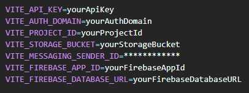
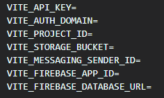
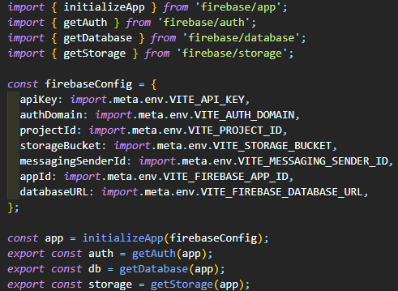
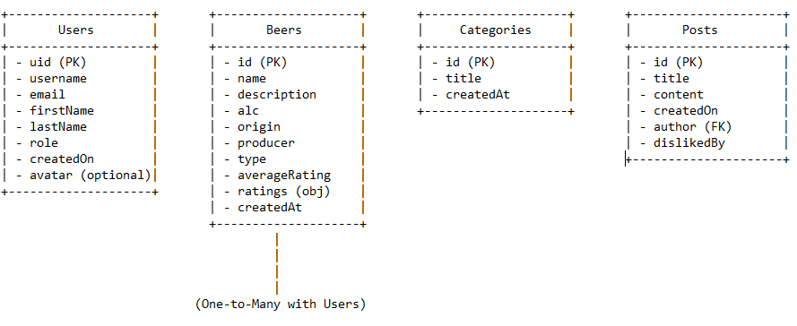
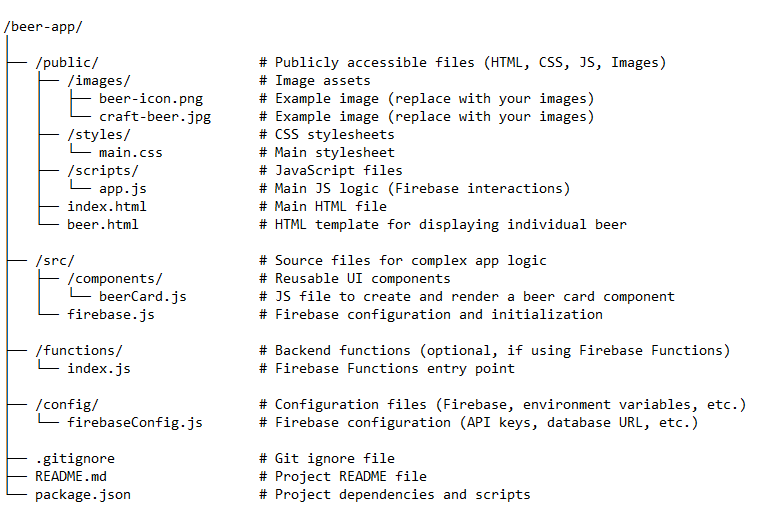

# Team7Forum 'Beer Foam'

**Beer Foam** is a web application for a discussion forum that allows users to create and manage threads, interact with posts, and manage profiles. The application is built with React and uses Firebase for authentication and database.

### 1. Contents

* [Features](#features)
* [Installation](#installation)
* [Configuration](#configuration)
* [Usage](#usage)
* [Project Structure](#project-structure)
* [Dependencies](#dependencies)

#### 1.1 Features

* **Authentication** : Users can register, log in, and manage their profiles.
* **Forums** : Users can view, create, and edit threads within various categories.
* **Voting** : Users can upvote and downvote posts.
* **Tags** : Support for tagging threads.
* **Admin Functions** : Admins can manage users and apply bans.

#### 1.2 Installation

#### 1.3 Configuration

Create a Firebase project ([Firebase console - create a project ](https://console.firebase.google.com/u/1/)) and obtain your Firebase configuration details. Update the `firebase-config.js` file with your Firebase credentials.

**Install the project dependencies:**

 

**Start the development server:**

This command will usually start a local server and you should see output in your terminal indicating that the server is running. You can then open your web browser and navigate to the address provided in the output (often `http://localhost:3000` or a similar URL) to view your application.

**Realtime Databese Rules:**

{
  "rules": {
    ".read": "true",
    ".write": "auth != null",
    "users": {
      ".indexOn": ["uid", "username", "handle"],
      "$uid": {
        ".read": "auth != null",
        ".write": "auth != null && auth.uid == $uid"
      }
    },
    "categories": {
      ".read": "true",
      ".indexOn": ["createdAt", "id"]
    },
    "threads": {
      ".read": "true",
      ".write": "true",
      ".indexOn": ["categoryId", "createdAt", "id", "replyCount", "title", "content", "authorName"] 
    },
    "replies": {
      ".read": "true",
      ".indexOn": ["createdAt", "id", "threadId", "author"]
    },
    "beers": {
      ".read": "true",
      ".write": "auth != null && (root.child('users').child(auth.uid).child('role').val() === 'admin' || root.child('users').child(auth.uid).child('role').val() === 'moderator')"
    }
  }
}

#### 1.4 Usage

* **Home Page** : Users can see the latest threads and navigate to various sections.
* **Register/Login** : Users can register or log in to their accounts.
* **Forum** : View categories, threads, and interact with posts.
* **Profile** : Manage user profiles and settings.
* **Admin Page** : Admins can manage users and moderate the forum.

#### 1.5 Project Structure

`src/` – Contains all the source code

    `components/` – Reusable UI components

    `services/` – Functions for interacting with Firebase

    `views/` – React components for different pages

    `state/` – Context for global state management

    `config/` – Firebase configuration

    `common/` – Common utilities and enums

    `CSS/` – Stylesheets

 `public/` – Static files like `index.html`

`firebase-config.js` – Firebase configuration file

#### 1.6 Dependencies

* `react`
* `react-dom`
* `react-router-dom`
* `firebase`
* `react-firebase-hooks`
* `react-icons`

### 2. Components

##### 2.1 App.jsx

 **Purpose** : The root component of the application that sets up the main layout and routing.

 **Key Features** :

* Contains routing logic for different pages using `react-router-dom`.
* Wraps the entire application with context providers (e.g., `AuthProvider`, `ForumProvider`).

##### 2.2 Main.jsx

 **Purpose** : The main entry point of the application where it initializes and renders the `App` component.

 **Key Features** :

* Imports and renders the `App` component.
* Includes any necessary global styles or configurations.

##### 2.3 Home.jsx

 **Purpose** : The landing page or homepage of the application.

 **Key Features** :

* Displays an overview of the forum.
* May include featured threads, categories, or announcements.

##### 2.4 Login.jsx

 **Purpose** : Provides a login form for users to authenticate.

 **Key Features** :

* Includes fields for username and password.
* Handles authentication logic and redirects on successful login.

##### 2.5 Register.jsx

 **Purpose** : Provides a registration form for new users to create an account.

 **Key Features** :

* Includes fields for user details such as email, username, and password.
* Handles account creation and redirects on successful registration.

##### 2.6 MyProfile.jsx

 **Purpose** : Displays the profile information of the currently logged-in user.

 **Key Features** :

* Shows user details such as name, email, and profile picture.
* Provides options to edit the user's profile or view their activity.

##### 2.7 SearchResultPage.jsx

 **Purpose** : Displays search results based on user queries.

 **Key Features** :

* Shows a list of threads, posts, or users that match the search criteria.
* Provides navigation or filtering options to refine search results.

##### 2.8 UserProfile.jsx

 **Purpose** : Displays detailed profile information for a specific user.

 **Key Features** :

* Shows user information such as bio, posts, and activity.
* Allows viewing and interacting with the user's content.

##### 2.9 AdminPage.jsx

 **Purpose** : Provides administrative functionality, such as managing users and content.

 **Key Features** :

* Allows administrators to view and manage users, threads, and categories.
* Provides tools for moderation and configuration.

##### 2.10 Beerpedia.jsx

 **Purpose** : Displays information about different types of beers, likely in a wiki-style format.

 **Key Features** :

* Provides detailed information and descriptions for various beers.
* Includes search and categorization options.

##### 2.11 Category.jsx

 **Purpose** : Displays threads and posts within a specific category.

 **Key Features** :

* Shows a list of threads and discussions related to the selected category.
* Provides navigation options to view specific threads.

##### 2.12 Thread.jsx

 **Purpose** : Displays a specific thread and its associated posts.

 **Key Features** :

* Shows the main thread content and user posts.
* Provides options to add new posts or reply to existing ones.

### 3. Environment Variables (.env)

The `.env` file contains sensitive configuration data required to connect and configure Firebase services in your application. These environment variables should not be uploaded to public repositories as they contain sensitive information.

Example content of a `.env` file:

##### 3.1 Explanation of Variables:

* **VITE_API_KEY** : Your Firebase API key.
* **VITE_AUTH_DOMAIN** : The Firebase Authentication domain for your project.
* **VITE_PROJECT_ID** : The project ID in Firebase.
* **VITE_STORAGE_BUCKET** : The address of Firebase Storage for your project.
* **VITE_MESSAGING_SENDER_ID** : Sender ID for Firebase Cloud Messaging.
* **VITE_FIREBASE_APP_ID** : The app ID in Firebase.
* **VITE_FIREBASE_DATABASE_URL** : The URL of Firebase Realtime Database.

##### 3.2 Environment Variables Sample (.env_sample)

The `.env_sample` file serves as a template for the `.env` configuration file. This file should be shared with the team so they know which environment variables are needed without exposing actual values.

Example content of a `.env_sample` file:

**Instructions:**

* Each variable should be filled with the corresponding value from the Firebase console or other project configuration.
* Ensure this file does not contain actual sensitive data, only the names of the variables.

##### 3.3 Firebase Configuration (firebase-config.js)

The `firebase-config.js` file initializes Firebase services in your application using data from the `.env` file. This file contains the logic to connect with Firebase Authentication, Realtime Database, and Storage.

Example content of the `firebase-config.js` file:

**Explanation:**

* **initializeApp(firebaseConfig)** : Initializes Firebase with the configuration data from the `.env` file.
* **getAuth(app)** : Enables the use of Firebase Authentication in your application.
* **getDatabase(app)** : Provides access to Firebase Realtime Database.
* **getStorage(app)** : Provides access to Firebase Storage.

This file should be included in your project to effectively and securely use Firebase services.

### 4. Entity-Relationship Diagram (ERD)

This ERD will represent the relationships between your data entities such as users, beers, categories, and posts.

##### 4.1 Explanation:

* **Users** : Stores user information such as username, email, first name, last name, role, and optionally an avatar URL. The `uid` is the primary key.
* **Beers** : Contains information about different beers including name, description, alcohol content (alc), origin, producer, type, and an average rating. Each beer has a unique `id` (primary key).
* **Categories** : Represents different categories for beers or posts, with each category having a unique `id` and a title.
* **Posts** : Stores posts made by users. Each post has an `id` (primary key), title, content, creation date, and a reference to the author (which is a foreign key pointing to the `Users` table). It also has a `dislikedBy` attribute that indicates which users disliked the post.

##### 4.2 Relationships:

* **One-to-Many Relationship between Users and Beers** : Each user can create or rate multiple beers.
* **One-to-Many Relationship between Categories and Beers** : Each category can contain multiple beers.
* **One-to-Many Relationship between Users and Posts** : Each user can create multiple posts.
* **One-to-Many Relationship between Posts and Users (dislikedBy)** : Each post can be disliked by multiple users.

### 5. Project Structure

##### 5.1 Breakdown:

* **/public/** : Contains all the files accessible by the client. This includes your main HTML files, stylesheets, scripts, and images.
* **/images/** : Store images that are used in your web app, such as beer images.
* **/styles/** : CSS files that style your HTML pages.
* **/scripts/** : JavaScript files to manage the app's client-side logic.
* **/src/** : Contains source code for reusable components and any complex application logic.
* **/components/** : Reusable components like beer cards that you can render multiple times.
* **firebase.js** : Firebase initialization and configuration, handling the connection to your Firebase Realtime Database.
* **/functions/** : If you're using Firebase Functions for backend operations, this folder will contain the code for your serverless functions.
* **/config/** : Store configuration files, such as Firebase settings.
* **.gitignore** : Specifies files and directories that should not be tracked by Git.
* **README.md** : Documentation about your project, explaining what it does and how to set it up.
* **package.json** : If using Node.js, this file will manage dependencies and scripts for your project.
